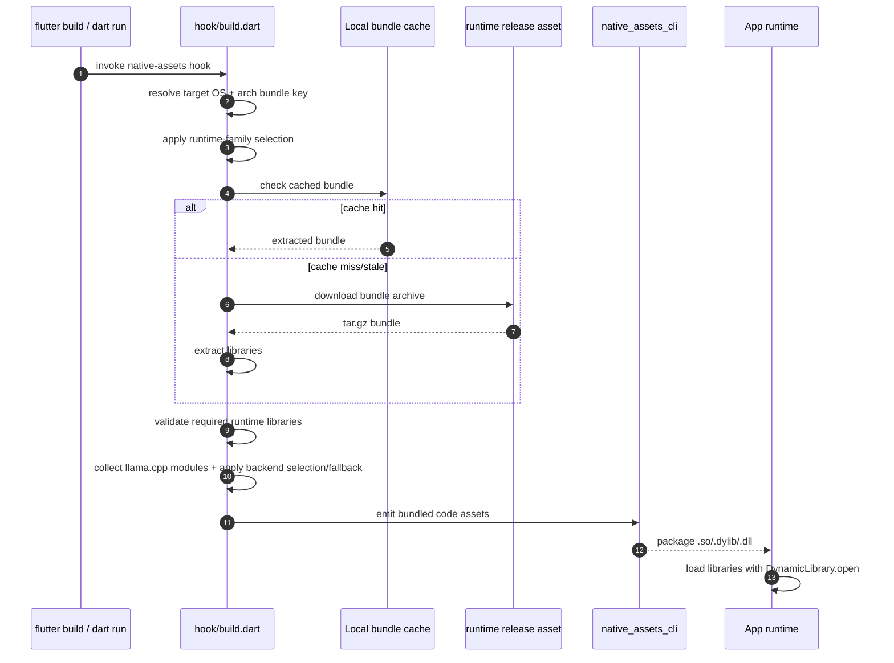

`llamadart` leverages Dart's `native_assets_cli` and a specialized build hook
to integrate native llama.cpp and LiteRT-LM runtimes into Flutter and Dart
applications without requiring users to compile C++ locally.

## The Build Hook Process

When you run `flutter build` or `dart run`, the build system invokes this
package's native-assets hook at `hook/build.dart`. This script resolves and
downloads the correct precompiled binaries for your target platform.



### 1. Platform Detection
The hook inspects the target operating system (iOS, Android, macOS, Windows, Linux) and architecture (arm64, x64).

### 2. Binary Resolution
Instead of compiling native runtimes from source—which requires CMake, Ninja,
and platform-specific toolchains—the hook downloads precompiled binaries from
GitHub Releases:

- `leehack/llamadart-native` for llama.cpp / GGUF runtime libraries.
- `leehack/litert-lm-native` for LiteRT-LM / `.litertlm` runtime libraries.

Native builds include both runtime families by default when the target platform
has both. Apps that only ship one model format can reduce package size with
`hooks.user_defines.llamadart.llamadart_native_runtimes`:

```yaml
hooks:
  user_defines:
    llamadart:
      llamadart_native_runtimes: [llama_cpp] # or [litert_lm]
```

The value can also be a per-platform map:

```yaml
hooks:
  user_defines:
    llamadart:
      llamadart_native_runtimes:
        runtimes: [llama_cpp, litert_lm]
        platforms:
          android-arm64: [litert_lm]
          linux-x64: [llama_cpp]
```

Use `llamadart_native_backends` separately to filter llama.cpp modules such as
Vulkan, CUDA, OpenCL, BLAS, and HIP inside the `llama_cpp` runtime family.

### 3. Dynamic Linking
Using `native_assets_cli`, the downloaded dynamic libraries (`.so`, `.dylib`,
`.dll`) are configured for **Dynamic Loading Bundled** when the runtime supports
that layout. This ensures the Flutter engine bundles the libraries into your
final IPA/APK/desktop app, and Dart FFI loads resolved library files at runtime
with `DynamicLibrary.open(...)`.

Some LiteRT-LM companion libraries must be copied next to the reported runtime
library instead of reported as independent native assets on every platform.
The hook validates the full expected companion set after extraction so missing
or stale `litert-lm-native` archives fail during the build rather than later at
engine creation.

On macOS, LiteRT-LM dylibs are staged as app-bundle frameworks instead of
opened directly from `.dart_tool`, because sandboxed apps cannot open arbitrary
files from the build cache. The example chat app includes an Xcode build phase
that calls `tool/macos_litert_lm_prepare_app.sh` after Flutter embeds its
frameworks.

### 4. Validation and fallback safeguards
- Runtime-family selection is explicit: `llama_cpp`, `litert_lm`, or both.
  Selecting an unavailable LiteRT-LM platform explicitly fails during the hook.
- Backend selection is bundle-aware: requested modules must exist in the
  platform/arch bundle.
- If requested modules are unavailable, the hook logs warnings and falls back
  to defaults.
- On `windows-x64`, the hook additionally validates CUDA/BLAS runtime
  dependencies before accepting a bundle.
- LiteRT-LM archives are checksum-pinned separately from llama.cpp archives and
  use a cache marker so stale extracted runtimes are re-extracted when the
  pinned release digest changes.

## The `llamadart-native` Bridge Repo

Because `llama.cpp` is a fast-moving C++ project, `llamadart` isolates the native build complexities into a separate repository: [leehack/llamadart-native](https://github.com/leehack/llamadart-native).

**Why a separate repository?**
- **CI/CD Isolation**: Compiling GPU backends (Metal, CUDA, Vulkan) across 5 operating systems takes significant CI time. Isolating this prevents the main Dart package from becoming sluggish during development.
- **Versioning**: It allows the Dart package to tightly pin to a specific, stable commit of `llama.cpp`.
- **Precompiled Distributions**: It acts as the host for the GitHub Releases that the `build.dart` hook downloads, ensuring end-users never have to deal with CMake errors.

## The `litert-lm-native` Runtime Repo

LiteRT-LM support uses a separate runtime distribution:
[leehack/litert-lm-native](https://github.com/leehack/litert-lm-native).
That repo packages the LiteRT-LM C API and companion libraries from upstream
Google AI Edge runtime artifacts for Android, iOS, macOS, Linux, and Windows.

The Dart package consumes those release archives directly from `hook/build.dart`
and routes `.litertlm` model bundles to `LiteRtLmBackend`. The high-level API
surface stays the same as GGUF loading, but backend selection is
format-specific:

```dart
await engine.loadModel(
  '/models/gemma-4-E2B-it.litertlm',
  modelParams: const ModelParams(
    liteRtLmBackend: LiteRtLmBackendPreference.gpu,
  ),
);
```

Use `LiteRtLmBackendPreference.npu` only on Android devices where the pinned
LiteRT-LM runtime and model bundle support the NPU delegate. If NPU creation
fails, `llamadart` reports the selected backend and model path in the error so
callers can fall back to GPU or CPU intentionally.
